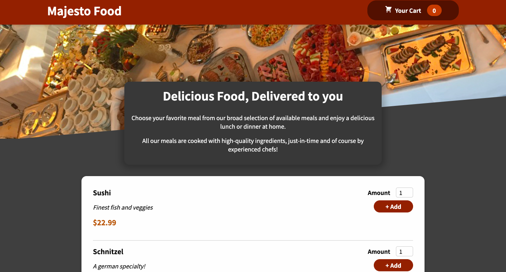

# Majesto Food

## Table of contents

- [Overview](#overview)
  - [Description](#description)
  - [Screenshot](#screenshot)
  - [Links](#links)
- [My process](#my-process)
  - [Built with](#built-with)
  - [Setup](#setup)
- [Author](#author)


## Overview

### Description

This is a ReactJS app, an online food ordering service. The website offers a wide range of food options from various cuisines and allows customers to add their meals to the cart and modify them and ability to order their food online. The app has some simple validation to demonstrate more complex logic but is easy to use, making it a convenient and secure way to enjoy delicious food. Built with

### Screenshot




### Links

- Live Site URL: [Majesto-Food](https://ahmedtakeshy.github.io/Majesto-Food/)

## My process

### Built with

- CSS custom properties
- Mobile-first workflow
- [React](https://reactjs.org/) - JS library
- [Firebase](https://firebase.google.com) - Google database
- [Styled Components](https://styled-components.com/) - For styles


### Setup

To run this project, install it locally using git clone or download it as a ZIP and npm:

```
$ cd ../Majesto
$ npm install
$ npm start
```


## Author

- Website - [Ahmed Takeshy](https://github.com/AhmedTakeshy/)
